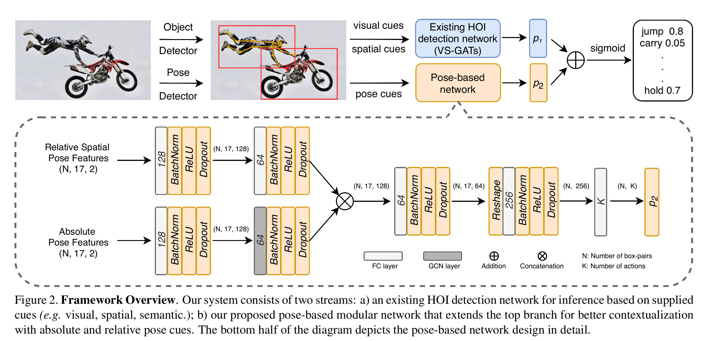
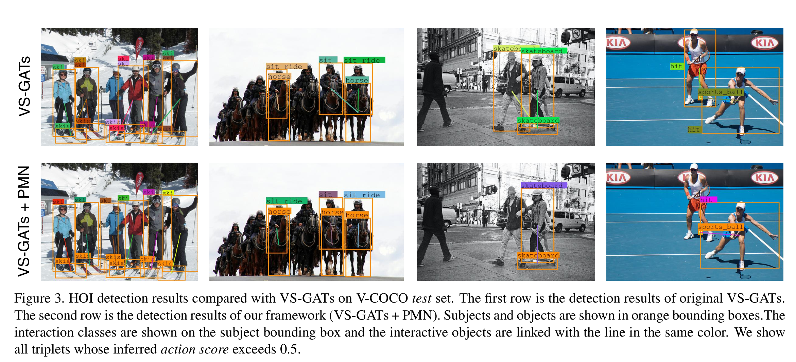

# Pose-based Modular Network for Human-Object Interaction Detection

<!---------------------------------------------------------------------------------------------------------------->
Official Pytorch implementation for [Pose-based Modular Network for Human-Object Interaction Detection]((https://arxiv.org/abs/2008.02042)).



<!---------------------------------------------------------------------------------------------------------------->
## Code Overview
In this project, we implement our method based on [VS-GATs](https://github.com/birlrobotics/vs-gats). The structure of the code in this project is similar to VS-GATs. You can check it for the description of each file.

<!---------------------------------------------------------------------------------------------------------------->
## Getting Started

### Prerequisites
This codebase was tested with Python 3.6, Pytorch 1.1.0, torchvision 0.3, CUDA 10.0, Ubuntu 16.04.

### Installation
1. Clone this repository.   

    ```
    git clone https://github.com/birlrobotics/PMN.git
    ```
  
2. Install Python dependencies:   

    ```
    pip install -r requirements.txt
    ```

### Prepare Data
#### Download Original Data (Optional)
1. Download the original [HICO-DET](http://www-personal.umich.edu/~ywchao/hico/) dataset and put it into `datasets/hico`.
2. Follow [here](https://github.com/s-gupta/v-coco) to prepare the original data of V-COCO dataset in `datasets/vcoco` folder.
3. (For VS-GATs) Download the pretrain word2vec model on [GoogleNews](https://code.google.com/archive/p/word2vec/) and put it into `./datasets/word2vec` 

#### Download the Processed Data
-  Download our processed data for [HICO-DET](https://drive.google.com/drive/folders/1DUr1tg0-53XKTWikruad2aS6rTAGZlvy?usp=sharing) and [V-COCO](https://drive.google.com/drive/folders/1tYAUmtSMH4B93DObhbfgEN8bDZ-5x3sp?usp=sharing) and put them into `datasets/processed` with the original file name.

#### Download the Pretrained Model of VS-GATs
-  In our method, we build our module based on the VS-GATs which is fixed when training. Download the pretrained model of VS-GATs for [HICO-DET](https://drive.google.com/drive/folders/13tNEZzGKrnIB6l-zCLO-kS7WyrSBCLPg?usp=sharing) and [V-COCO](https://drive.google.com/drive/folders/1Ao8s09HdS_D-Vs-6tT7Gb0faK-GM3eT2?usp=sharing) and put them into `./checkpoints` with the original file name.

### Training
- On HICO-DET dataset:  
    ```
    python hico_train.py --exp_ver='hico_pmn' --b_s=32  --d_p=0.2 --bn='true' --n_layers=1 --b_l 0 3  --lr=3e-5
    ```
    
- Similarly, for V-COCO datset:
    ```
    python vcoco_train.py --exp_ver='vcoco_pmn' --b_s=32  --d_p=0.2 --bn='true' --n_layers=1 --b_l 0 3 --o_c_l 64 64 64 64 --lr=3e-5 
    ```

- You can visualized the training process through tensorboard: `tensorboard --logdir='log/'`.

- Checkpoints will be saved in `checkpoints/` folder.

### Testing
- Run the following script: option 'final_ver' means the name of which experiment and 'path_to_the_checkpoint_file' means where the checkpoint file is. (You can use the checkpoint of [HICO-DET](https://drive.google.com/file/d/1Y5na8f7AIh_wblVDRePVpcBpn0bWfOJw/view?usp=sharing) and [V-COCO](https://drive.google.com/file/d/1GPnwdzMl3PI1N_RuFLc7iJrWTHDU2QOP/view?usp=sharing) to reproduce the detection results in our paper.).

    ```
    bash hico_eval.sh 'final_ver' 'path_to_the_checkpoint_file'
    ```

- For V-COCO dataset, you first need to cover the original `./datasets/vcoco/vsrl_eval.py` with the new one in `./result/vsrl_eval.py` because we add some codes to save the detection results. Then run:

    ```
    python vcoco_eval.py -p='path_to_the_checkpoint_file'
    ```

- Results will be saved in `result/` folder.

### Results
- Please check the paper for the quantitative results and several qualitative detection results are as follow:
    

### Acknowledgement
In this project, some codes which process the data and eval the model are built upon [VS-GATs: Visual-Semantic Graph Attention Networks for Human-Object Interaction Detecion](https://github.com/birlrobotics/vs-gats), [ECCV2018-Learning Human-Object Interactions by Graph Parsing Neural Networks](https://github.com/SiyuanQi/gpnn) and [ICCV2019-No-Frills Human-Object Interaction Detection: Factorization, Layout Encodings, and Training Techniques](https://github.com/BigRedT/no_frills_hoi_det). Thanks them for their great works.
